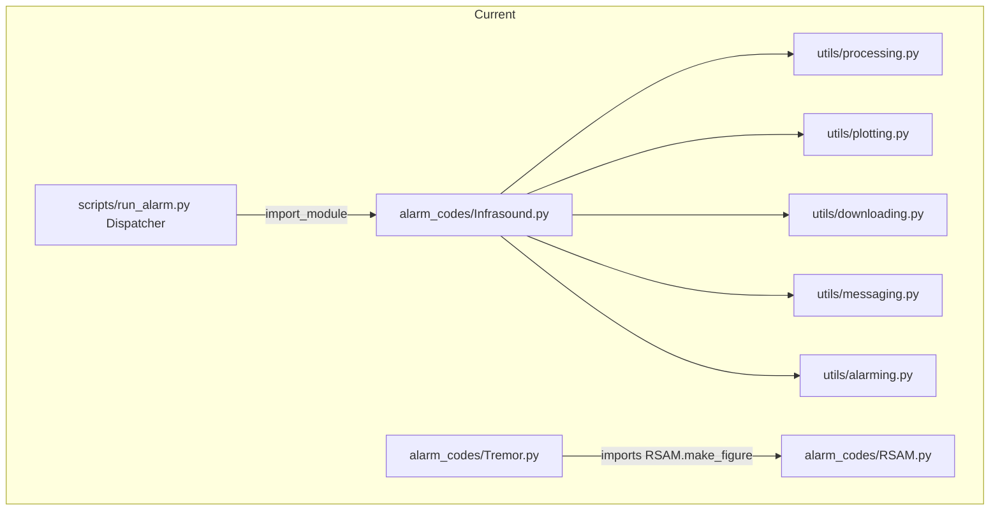
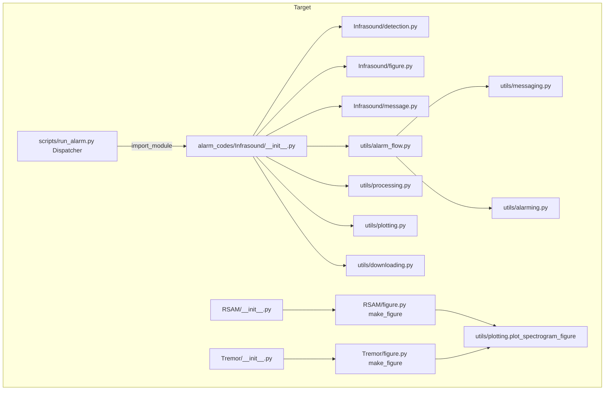

# Design Document

## Overview

This design restructures the `avo_alarms` package so that:

1. Each alarm becomes a small **Alarm_Package** (`alarm_codes/<Alarm>/`) instead of a single file, with detection/algorithm code, figure code, and message code split into dedicated submodules.
2. The shared utility modules (`utils/processing.py`, `utils/plotting.py`, `utils/downloading.py`) keep **only** functions with two or more alarm consumers (the litmus test). Single-consumer functions move into the alarm that owns them.
3. The two duplicated `run_alarm()` blocks — the **Cron_Latency_Backup** and the **CRITICAL Send_Sequence** — are consolidated into single shared implementations.

The defining constraint is **behavior preservation**. This is a refactoring: detection state (`OK`/`WARNING`/`CRITICAL`), message subject/body, generated figures, Icinga heartbeats, alarm-history database rows, and temporary-file cleanup must be byte-for-byte equivalent to the pre-restructure baseline. The public entry point `run_alarm(config, T0, test_flag=False, mm_flag=True, icinga_flag=True, force_flag=False)` and the Dispatcher's `import_module(f"avo_alarms.alarm_codes.{config.alarm_type}")` contract are frozen.

### Goals

- Make each alarm's ownership of its code explicit and local.
- Reduce `utils/` to genuinely-shared, multi-consumer code.
- Define the cron-latency backup and critical send sequence once.
- Introduce no behavior change and no circular imports.

### Non-Goals

- No change to detection algorithms, thresholds, message wording, or figure layout.
- No change to the runtime `.py` config modules loaded via `CONFIGS_DIR` (the form `setup_utils.load_config` reads and execs); these config modules and the `load_config` contract are unchanged.
- No change to the public signatures in `utils/setup_utils.py` (`load_config`, `load_volcano_list`, `update_infrasound_config`).
- No aggressive dead-code deletion (see "Zero-Consumer Functions" — handled conservatively).

### Key Design Decisions (summarized; rationale below)

| Decision | Choice | Rationale |
|---|---|---|
| Consolidation mechanism | **Shared template functions** (not a base `Alarm` class) | Codebase is functional throughout; `run_alarm` is a free function the Dispatcher imports. Template functions match the idiom and avoid forcing alarms into a class hierarchy. |
| Where shared templates live | New module `utils/alarm_flow.py` | Orchestrates `messaging` + `alarming`; lives in `utils/` so alarm packages depend on it one-directionally (no cycle). |
| `RSAM.make_figure` (used by RSAM **and** Tremor) | Move to `utils/plotting.py` as a shared spectrogram-figure builder | Two alarm consumers → Shared_Function by litmus test (Req 11.4). Keeps alarm packages from importing each other. |
| Alarm-specific figure/message divergence | Templates take **callables** (`figure_factory`, `message_factory`) | Lets the one shared Send_Sequence forward alarm-specific figure/message construction while owning ordering and error handling. |
| Tremor cron sleep variant | `extra_sleep` parameter on the shared backup | Tremor sleeps `latency + taper`; preserving this is required by Req 9. |

## Architecture

### Current vs. Target Layout





### Dependency Direction (no cycles)

The dependency graph is strictly layered. Arrows point **downward only**; nothing in a lower layer imports a higher layer.

```
Dispatcher (scripts/run_alarm.py)
        │  import_module("avo_alarms.alarm_codes.<Alarm>")
        ▼
Alarm_Packages (alarm_codes/<Alarm>/…)
        │  import
        ▼
Shared flow templates (utils/alarm_flow.py)
        │  import
        ▼
Shared utilities (utils/processing, plotting, downloading, messaging, alarming)
        │  import
        ▼
Foundation (utils/setup_utils.py)
```

Invariants that guarantee acyclicity (Req 11.2):
- `utils/*` modules **never** import from `avo_alarms.alarm_codes.*`.
- Alarm packages **never** import another alarm package. The only previous violation (Tremor → RSAM) is removed by relocating `make_figure` to `utils/plotting.py`.
- `utils/alarm_flow.py` imports only `messaging`, `alarming`, `setup_utils`. Alarm-specific behavior reaches it through **callables passed in**, so it never needs to import an alarm.

### Alarm Package Shape

Every restructured alarm follows this shape (submodules present only when the alarm has that kind of code):

```
alarm_codes/<Alarm>/
    __init__.py     # defines run_alarm (the entry/skeleton). Dispatcher resolves here.
    detection.py    # alarm-specific algorithm / data-shaping code (when present)
    figure.py       # alarm-specific figure code (when present)
    message.py      # alarm-specific create_message (when present)
```

`__init__.py` defines `run_alarm` directly so that `avo_alarms.alarm_codes.<Alarm>` resolves to a module exposing `run_alarm` (Req 1.1, 1.3, 2.2). The skeleton imports its own submodules and the shared `utils` modules. (Re-export form `from .alarm import run_alarm` is an acceptable alternative if a skeleton grows large; `__init__.py` must expose `run_alarm` either way.)

## Components and Interfaces

### 1. Shared flow templates — `utils/alarm_flow.py` (new module)

This module holds the two consolidated blocks. It is the heart of the consolidation work (Req 7, Req 8).

#### 1a. Cron latency backup

```python
import math
import os
import time
from avo_alarms.utils.setup_utils import get_logger

logger = get_logger(__name__)


def apply_cron_latency_backup(config, T0, extra_sleep=0.0):
    """Single shared implementation of the Cron_Latency_Backup block.

    Returns a (possibly adjusted) T0. Sleeps as a side effect when appropriate.

    - WHEN FROMCRON == "yep" and config.latency < 30:
        sleep(config.latency + extra_sleep), return T0 unchanged.
    - WHEN FROMCRON == "yep" and config.latency >= 30:
        return T0 - ceil(config.latency / 60) * 60 (no sleep).
    - OTHERWISE: return T0 unchanged, do not sleep.

    `extra_sleep` exists solely to preserve Tremor's existing behavior, which
    sleeps `config.latency + config.taper`. Infrasound and RSAM pass 0.0.
    """
    if os.getenv("FROMCRON") == "yep":
        if config.latency < 30:
            time.sleep(config.latency + extra_sleep)
        else:
            dt = math.ceil(config.latency / 60) * 60
            T0 = T0 - dt
            logger.info(f"Backing up {dt} seconds to align with minute marks")
    return T0
```

Callers (Req 7.2):
- Infrasound: `T0 = apply_cron_latency_backup(config, T0)`
- RSAM: `T0 = apply_cron_latency_backup(config, T0)`
- Tremor: `T0 = apply_cron_latency_backup(config, T0, extra_sleep=config.taper)`

> Design note: requirement 7.3 reads "sleep for `config.latency` seconds." Tremor's real baseline sleeps `latency + taper`. Behavior preservation (Req 9) governs, so the shared implementation is parameterized rather than dropping Tremor's taper. This is a deliberate, documented deviation from the literal wording of 7.3 in favor of 9.

#### 1b. Critical send sequence

The Send_Sequence is duplicated near-verbatim in **Infrasound, RSAM, and Tremor** — the three alarms that gate on `alarming.can_send`. The other alarms use a different event-id de-duplication flow (`already_processed` / `check_new_event_ids` / `filter_dataframe`) and are out of scope for this consolidation.

```python
import os
import traceback
from avo_alarms.utils import messaging, alarming
from avo_alarms.utils.setup_utils import get_logger

logger = get_logger(__name__)


def run_send_sequence(
    config,
    T0,
    state,
    state_message,
    figure_factory,
    message_factory,
    *,
    can_send_kwargs=None,
    record_kwargs=None,
    mm_flag=True,
    icinga_flag=True,
    test_flag=False,
):
    """Single shared implementation of the CRITICAL Send_Sequence (Req 8).

    Performs, in order (Req 8.3):
      1. alarming.can_send rate-limit check
      2. figure creation via figure_factory(), guarded by try/except (Req 8.5)
      3. message creation via message_factory() -> (subject, message)
      4. messaging.post_mattermost, guarded by try/except
      5. messaging.send_alert
      6. alarming.record_send
      7. os.remove(filename) if a file was produced
      8. messaging.icinga heartbeat

    Alarm-specific arguments are forwarded through can_send_kwargs and
    record_kwargs (e.g. Infrasound's volcano target name) (Req 8.6).

    Returns the final state_message (so the caller can use it if needed).
    """
    can_send_kwargs = can_send_kwargs or {}
    record_kwargs = record_kwargs or {}

    # 1. rate limit (Req 8.4)
    if not alarming.can_send(config, T0=T0, test=test_flag, **can_send_kwargs):
        logger.warning(f"Rate limit: skipping alarm {config.alarm_name}")
        state_message = f"{state_message} (alarm skipped due to rate limit)"
        messaging.icinga(config, state, state_message, send=icinga_flag)
        return state_message

    # 2. figure (Req 8.5)
    try:
        filename = figure_factory()
    except Exception as e:
        logger.error("problem generating figure")
        logger.error(e)
        logger.error(traceback.format_exc())
        filename = None

    # 3. message
    subject, message = message_factory()

    # 4. mattermost (guarded)
    try:
        mm_url = messaging.post_mattermost(
            config, subject, message, attachment=filename, send=mm_flag, test=test_flag
        )
        message = f"{message}\n\n{mm_url}"
    except Exception as e:
        logger.error("problem posting to mattermost")
        logger.error(e)
        logger.error(traceback.format_exc())

    # 5. email/sms
    messaging.send_alert(
        config.alarm_name, subject, message, attachment=filename, test=test_flag
    )

    # 6. record send
    alarming.record_send(config, T0, test=test_flag, **record_kwargs)

    # 7. cleanup
    if filename:
        os.remove(filename)

    # 8. icinga heartbeat
    messaging.icinga(config, state, state_message, send=icinga_flag)
    return state_message
```

Per-alarm invocation contract:

| Alarm | `figure_factory` | `message_factory` | `can_send_kwargs` | `record_kwargs` |
|---|---|---|---|---|
| Infrasound | `lambda: figure.make_figure(st, target, T0, config, mx_pressure, test=test_flag)` | `lambda: message.create_message(t1, t2, st, target, azimuth, d_Azimuth, velocity, mx_pressure)` | `{"volcano": target["name"]}` | `{"volcano": target["name"]}` |
| RSAM | `lambda: figure.make_figure(nslc, T0, config, test=test_flag)` (wrapper → `plotting.plot_spectrogram_figure`) | `lambda: message.create_message(t1, t2, stas, rms, lvlv, DR, config.alarm_name)` | `{}` | `{}` |
| Tremor | `lambda: figure.make_figure(nslc, T0, config, test=test_flag)` (wrapper → `plotting.plot_spectrogram_figure`) | `lambda: message.create_message(T0 - config.duration, T0, config.alarm_name, duration_text)` | `{}` | `{"volcano": config.volcano}` |

> Design note: Infrasound builds its `subject, message` after the figure in the baseline, and RSAM/Tremor do likewise. Because message construction never reads the figure filename, passing a `message_factory` invoked after `figure_factory` preserves both ordering (Req 8.3) and output. The `post_mattermost` appends `mm_url` to the message exactly as each baseline does.

> Design note on Infrasound's `create_message` arg list: the relocated `message.create_message` keeps the existing positional signature `(t1, t2, st, target, azimuth, d_Azimuth, velocity, mx_pressure)`. The closure captures these from the `run_alarm` scope.

### 2. Consolidation mechanism: template functions vs. base class

The open decision from requirements is **shared template functions** vs. a **base `Alarm` class**.

**Recommendation: template functions** (chosen above).

Tradeoffs:

| Aspect | Template functions (chosen) | Base `Alarm` class |
|---|---|---|
| Fit with codebase | Matches the existing functional style; `run_alarm` stays a free function the Dispatcher imports. | Requires wrapping each alarm in a subclass and adapting the Dispatcher's `import_module(...).run_alarm(...)` call path or adding a thin `run_alarm` shim per class. |
| Behavior preservation | Each alarm keeps its own `run_alarm` skeleton verbatim except for the two extracted calls — minimal diff, easy to diff-review against baseline. | Larger structural change; higher risk of subtle reordering. |
| Forwarding alarm-specific data | Explicit via `can_send_kwargs` / `record_kwargs` / factories. | Via overridden methods/attributes; more indirection. |
| Discoverability | One module (`alarm_flow.py`) with two functions. | Behavior spread across base + overrides. |
| Extensibility for divergent alarms | The seven non-`can_send` alarms simply don't call the template; no inheritance burden. | A class hierarchy invites forcing divergent alarms into a shared base they don't fit. |

A base class would only pay off if all ten alarms shared one control flow. They do not — only three share the `can_send` send sequence. Template functions localize the shared logic without imposing structure on the rest.

### 3. Relocated shared figure builder — `utils/plotting.py`

`make_figure(nslc, T0, config, test=False)` currently lives in `RSAM.py` and is imported by Tremor (`RSAM.make_figure(...)`). It is generic (spectrogram mosaic over a list of NSLC). It moves to `utils/plotting.py`:

```python
def plot_spectrogram_figure(nslc, T0, config, test=False):
    """Shared spectrogram-mosaic figure (formerly RSAM.make_figure).
    Consumed by RSAM and Tremor."""
    # body identical to current RSAM.make_figure
```

This removes the Tremor→RSAM cross-package import (Req 11.2, 11.4).

#### Per-alarm `figure.py` wrappers (RSAM, Tremor)

Although the actual figure builder is the shared `plotting.plot_spectrogram_figure`, RSAM and Tremor each keep their own `figure.py` submodule containing a **thin** `make_figure(...)` wrapper that delegates to it:

```python
# RSAM/figure.py  (Tremor/figure.py is identical in shape)
from avo_alarms.utils import plotting


def make_figure(nslc, T0, config, test=False):
    """Thin wrapper delegating to the shared spectrogram-figure builder."""
    return plotting.plot_spectrogram_figure(nslc, T0, config, test=test)
```

Each alarm's `__init__.py` calls its own `figure.make_figure(...)` rather than reaching into `plotting` directly.

> Design note (wrapper rationale): the `figure.py` wrapper is intentionally **thin** and exists for three reasons — (1) **consistency**: every alarm package keeps the uniform `detection.py` / `figure.py` / `message.py` shape, so RSAM and Tremor are not special-cased; (2) **navigation**: "this alarm's figure logic" always has one obvious home (`<Alarm>/figure.py`), even when that logic is currently just a delegation; (3) **future-divergence seam**: if either alarm later needs a figure tweak that the other does not, the change lands in its own `figure.py` without touching the shared builder or the other alarm. Critically, this indirection does **not** change the Litmus_Test result: `plot_spectrogram_figure` still lives in `utils/plotting.py` because it has two alarm consumers (RSAM, Tremor), and the Tremor→RSAM cross-package import is still removed (Req 11.2, 11.4). The wrapper adds an indirection layer only; it does not reclassify the shared builder as single-consumer code.

### 4. Per-alarm package interfaces

Each `__init__.py` exposes `run_alarm(config, T0, test_flag=False, mm_flag=True, icinga_flag=True, force_flag=False)` unchanged (Req 1.2). Submodule contents are listed in the Migration Map (Data Models).

## Data Models

This is a code-reorganization feature; the "data models" are the **function classification** and the **migration map**. Classification is by **distinct alarm consumer count** found through call-site analysis (Req 3.1–3.5).

### Consumer classification (call-site analysis results)

#### Single_Consumer_Functions → relocate into owning Alarm_Package (Req 4)

| Function | Current location | Sole consumer | New location |
|---|---|---|---|
| `format_cimss_dataframe` | `processing.py` | NOAA_CIMSS | `NOAA_CIMSS/detection.py` |
| `check_ignore_volcano` | `processing.py` | NOAA_CIMSS | `NOAA_CIMSS/detection.py` |
| `download_cimss_vv_api` | `downloading.py` | NOAA_CIMSS | `NOAA_CIMSS/detection.py` |
| `scrape_cimss_alert` | `downloading.py` | NOAA_CIMSS | `NOAA_CIMSS/detection.py` |
| `get_cimss_image` | `downloading.py` | NOAA_CIMSS | `NOAA_CIMSS/detection.py` |
| `cimss_mm_channels` | `messaging.py` | NOAA_CIMSS | `NOAA_CIMSS/message.py` |
| `pirep_archive_to_dataframe` | `processing.py` | Pilot_Report | `Pilot_Report/detection.py` |
| `check_volcano_mention` | `processing.py` | Pilot_Report | `Pilot_Report/detection.py` |
| `download_pilot_reports` | `downloading.py` | Pilot_Report | `Pilot_Report/detection.py` |
| `RSAM_to_DR` | `processing.py` | RSAM | `RSAM/detection.py` |
| `download_lightning` | `downloading.py` | Lightning | `Lightning/detection.py` |
| `download_mesonet_vaa_list` | `downloading.py` | VAA | `VAA/detection.py` |
| `download_SO2` | `downloading.py` | SO2 | `SO2/detection.py` |

> `check_ignore_volcano` and `cimss_mm_channels` are not in the requirements' enumerated list but are confirmed single-consumer (NOAA_CIMSS only) by call-site analysis. Req 3.5 mandates using the call-site result, so they relocate too.

#### Shared_Functions → remain in `utils/` (Req 5)

| Function | Module | Alarm consumers (≥2) |
|---|---|---|
| `download_waveforms` | downloading | Infrasound, RSAM, Tremor, Magnitude |
| `download_hypocenters_csv` | downloading | Magnitude, Swarm |
| `download_hypocenter_xml` | downloading | Magnitude, Swarm |
| `add_metadata` | processing | Infrasound, Tremor |
| `find_nearest_volcano` | processing | Lightning, NOAA_CIMSS, Pilot_Report, VAA, Magnitude, Swarm |
| `volcano_distance` | processing | NOAA_CIMSS, Pilot_Report, SO2, Magnitude (+ internal) |
| `addPhaseHint` | processing | Magnitude, Swarm |
| `eq_picks_to_dataframe` | processing | Magnitude, Swarm |
| `format_timestring` | messaging | Infrasound, RSAM, Tremor, Lightning, NOAA_CIMSS, Pilot_Report, SO2, VAA |
| `post_mattermost` | messaging | all alarms |
| `send_alert` | messaging | all alarms |
| `icinga` | messaging | all alarms |
| `can_send` | alarming | Infrasound, RSAM, Tremor |
| `record_send` | alarming | all alarms |
| `already_processed` / `check_new_event_ids` / `filter_dataframe` | alarming | multiple |
| `save_file`, `plot_spectrogram`, `format_spec_xaxis`, `make_map`, `map_ticks`, `add_volcanoes_to_map`, `add_scale_bar`, `add_inset_polygon`, `get_axes_and_ratios`, `plot_station_traces`, `time_ticks` | plotting | multiple |
| `plot_spectrogram_figure` (relocated from RSAM) | plotting | RSAM, Tremor |
| `IRIS_client` | downloading | processing, plotting (infra-shared) |

> `addPhaseHint` and `eq_picks_to_dataframe` are confirmed **Shared** (Magnitude + Swarm), overriding any prior "Magnitude-only" assumption (Req 3.5).

#### Zero-Consumer Functions → conservative handling

These have **no** alarm consumers found by call-site analysis:

| Function | Module | Notes |
|---|---|---|
| `compare_to_old_events` | processing | No references found. |
| `catalog_to_dataframe` | processing | No references found. |
| `Dr_to_RSAM` | processing | Manual calibration helper; no runtime consumer. |
| `download_hypocenters` | downloading | Superseded by `_csv`/`_xml`. |
| `download_vaa_from_nws_api` | downloading | Explicitly "currently not implemented". |
| `check_inventory` | processing | Only a commented-out reference. |
| `download_station_xml` | downloading | Consumed by `scripts/update_metadata.py` (a script, not an alarm). **Keep in `downloading.py`.** |

Handling: the litmus test classifies by *alarm* consumers and is silent on zero-consumer code. To honor behavior preservation and avoid scope creep, **leave these in place**. `download_station_xml` explicitly stays because a script depends on it. The genuinely-unreferenced functions are flagged for a **separate** cleanup decision and are intentionally out of scope here. (Req 5.3 *permits* removing a proven zero-consumer function but does not require it; we defer.)

### Migration Map (target tree)

```
alarm_codes/
    Infrasound/
        __init__.py     # run_alarm skeleton
        detection.py    # setup_coordinate_system, calc_triggers, associator,
                        #   inversion, xcorr_align_stream, get_target_backazimuth   (Req 6.2)
        figure.py       # make_figure (Infrasound-specific stack/seismic figure)
        message.py      # create_message
    RSAM/
        __init__.py     # run_alarm skeleton
        detection.py    # RSAM_to_DR (relocated)                                    (Req 4.5)
        figure.py       # make_figure -> thin wrapper over plotting.plot_spectrogram_figure
        message.py      # create_message
    Tremor/
        __init__.py     # run_alarm skeleton (uses figure.make_figure,
                        #   apply_cron_latency_backup with extra_sleep, run_send_sequence)
        detection.py    # test_traveltime, run_enveloc, remove_hp_detects,
                        #   preprocess, qc_checks, make_env, create_icinga_test
        figure.py       # make_figure -> thin wrapper over plotting.plot_spectrogram_figure
        message.py      # create_message
    Lightning/
        __init__.py     # run_alarm skeleton
        detection.py    # download_lightning (relocated), inner_outer,
                        #   get_state_message, get_direction
        figure.py       # plot_fig
        message.py      # create_message
    NOAA_CIMSS/
        __init__.py     # run_alarm skeleton
        detection.py    # download_cimss_vv_api, scrape_cimss_alert, get_cimss_image,
                        #   format_cimss_dataframe, check_ignore_volcano (all relocated),
                        #   process_alert_soup + get_* soup parsers
        figure.py       # plot_fig
        message.py      # create_message, cimss_mm_channels (relocated)
    Pilot_Report/
        __init__.py     # run_alarm skeleton
        detection.py    # download_pilot_reports, pirep_archive_to_dataframe,
                        #   check_volcano_mention (relocated), get_height_text,
                        #   get_pilot_remark
        figure.py       # plot_fig
        message.py      # create_message
    SO2/
        __init__.py     # run_alarm skeleton
        detection.py    # download_SO2 (relocated), get_so2_images
        figure.py       # plot_fig
        message.py      # create_message
    VAA/
        __init__.py     # run_alarm skeleton
        detection.py    # download_mesonet_vaa_list (relocated), process_vaa_id,
                        #   process_polygons, text_to_latlon, get_extent
        figure.py       # make_map (VAA-specific)
        message.py      # create_message
    Magnitude/
        __init__.py     # run_alarm skeleton
        detection.py    # process_event
        figure.py       # plot_event
        message.py      # create_message
    Swarm/
        __init__.py     # run_alarm skeleton
        detection.py    # get_swarms, check_swarm_continue, compare_swarms,
                        #   build_download_url
        figure.py       # make_figure (Swarm-specific)
        message.py      # create_message
    __init__.py         # unchanged (load_dotenv)
utils/
    alarm_flow.py       # NEW: apply_cron_latency_backup, run_send_sequence
    processing.py       # shared only (single-consumer fns removed)                 (Req 4.4)
    plotting.py         # shared + plot_spectrogram_figure (relocated from RSAM)
    downloading.py      # shared only (single-consumer fns removed)
    messaging.py        # shared only (cimss_mm_channels removed)
    alarming.py         # unchanged
    setup_utils.py      # unchanged
```

### Import-rewrite obligations (Req 11.3)

For every relocated function, all references update to the new path, and the originating `utils` module no longer defines it:

- Owning alarm imports relocated functions from its own submodule, e.g. NOAA_CIMSS `__init__.py`: `from .detection import download_cimss_vv_api, scrape_cimss_alert, ...`.
- RSAM and Tremor import their figure entry point from their own submodule, e.g. `from .figure import make_figure`; each `figure.py` in turn imports `from avo_alarms.utils import plotting` and delegates to `plotting.plot_spectrogram_figure`.
- Tremor drops `from avo_alarms.alarm_codes import RSAM`.
- Any `processing.<relocated>` / `downloading.<relocated>` / `messaging.cimss_mm_channels` call sites are rewritten to the new owner.

## Correctness Properties

*A property is a characteristic or behavior that should hold true across all valid executions of a system — essentially, a formal statement about what the system should do. Properties serve as the bridge between human-readable specifications and machine-verifiable correctness guarantees.*

This feature is primarily a code reorganization, so most acceptance criteria are verified by structural, import, ordering, and golden behavior-preservation tests (see Testing Strategy) rather than property-based tests. The prework identified exactly **one** criterion family that is a genuinely universal property over a large input domain: the extracted cron-latency backup time math. Acceptance criteria 7.3, 7.4, and 7.5 collapse into a single comprehensive property because together they define one total function over the entire latency domain and the two `FROMCRON` states.

The deterministic single-branch behaviors (Send_Sequence ordering 8.3, rate-limit skip 8.4, figure-failure handling 8.5) and the baseline-equivalence criteria (9.x) are intentionally **not** expressed as properties: they have no meaningful input variation that 100 iterations would exercise, and the behavior baselines must be captured per recorded fixture. They are covered by example/edge tests.

### Property 1: Cron latency backup time math

*For any* `config.latency` value, the shared `apply_cron_latency_backup(config, T0, extra_sleep)` SHALL satisfy all of the following:
- when `FROMCRON` is not `"yep"`: the returned `T0` equals the input `T0` and no sleep occurs;
- when `FROMCRON == "yep"` and `latency < 30`: the returned `T0` equals the input `T0` and the function sleeps for `latency + extra_sleep` seconds;
- when `FROMCRON == "yep"` and `latency >= 30`: the function does not sleep and the returned `T0` equals the input `T0` minus `ceil(latency / 60) * 60` seconds.

**Validates: Requirements 7.3, 7.4, 7.5**

## Error Handling

Error-handling behavior is **preserved exactly**; the restructure only moves where the code lives.

- **Figure creation failure** inside the Send_Sequence: caught, logged (`logger.error` + traceback), `filename` set to `None`/`[]` as in the baseline, and processing continues (Req 8.5). The shared `run_send_sequence` owns this try/except for Infrasound/RSAM/Tremor; the other alarms keep their own inline try/except (unchanged).
- **Mattermost post failure**: caught and logged; the alert still proceeds via `send_alert` (mirrors baseline). Owned by `run_send_sequence` for the three consolidated alarms.
- **Rate limit (`can_send` returns `False`)**: skip send, append "(alarm skipped due to rate limit)" to the state message, send the Icinga heartbeat, return without `send_alert`/`record_send` (Req 8.4).
- **Dispatcher-level errors**: unchanged. Any exception that propagates out of `run_alarm` is caught in `scripts/run_alarm.py` and routed to the existing error-notification path (`messaging.send_alert("Error", ...)`). The restructure must not swallow exceptions that previously propagated, nor introduce new ones (Req 9.6, 9.7). In particular, import errors must not be introduced (Req 11.1).
- **Temporary-file cleanup**: `os.remove(filename)` runs only when a figure file was produced, exactly as before (Req 9.5).

Import integrity is treated as an error-handling concern: package import must not raise `ImportError`/`ModuleNotFoundError` (Req 11.1), and the layered dependency rule prevents circular imports (Req 11.2).

## Testing Strategy

The gating criterion is behavior preservation, verified with external side effects replaced by test doubles (Req 12.1). The suite combines property-based tests (for the one genuinely universal piece of logic), example/golden tests (for behavior preservation), and import smoke tests.

### Test doubles

All of these are mocked/patched so tests run offline and deterministically:
- `downloading.download_waveforms`, `download_hypocenters_csv`, `download_hypocenter_xml`, and all relocated `download_*` functions → return canned fixtures.
- `messaging.post_mattermost`, `messaging.send_alert`, `messaging.icinga` → record calls (args, order) without network I/O.
- `alarming.can_send`, `record_send`, `already_processed`, DB connections → in-memory or mocked; assert on recorded fields.
- `plotting.save_file` / figure builders → return a sentinel path; `os.remove` patched to record the call.
- Environment: `FROMCRON`, `TIMEZONE`, etc. set explicitly per test.

> Config fixtures (not mocked): the golden behavior-preservation tests load **real `.py` config modules** through `setup_utils.load_config` so `run_alarm` is driven with genuine config objects. The harness sets `CONFIGS_DIR` to the repo's in-repo `config/` directory (the `.py` config modules now checked into the repo), matching the runtime `.py`-module config convention (the same convention `download_station_xml` relies on when it globs `CONFIGS_DIR` for `*.py`). The `config/*.yml` files in that directory are not consumed.

### Property-based testing (applicable, narrow)

Most acceptance criteria here are structural (module layout, import paths) or example-based (golden behavior on recorded inputs) and are **not** suitable for PBT. One piece of extracted logic *is* a clean universal property: the **cron latency backup** time math holds for all latency values. A property library (e.g. **Hypothesis**) is used for it.

- Library: Hypothesis (Python). Do not hand-roll generators.
- Minimum 100 iterations per property test.
- Each property test is tagged with a comment: **Feature: alarm-modules-restructure, Property {n}: {property text}**.
- Each correctness property is implemented by a single property-based test.

### Example / golden behavior-preservation tests (Req 12.2, 12.3)

For each restructured alarm, drive `run_alarm` with a recorded input fixture and assert the **Behavior_Baseline**:
- Detection `state` matches (`OK`/`WARNING`/`CRITICAL`) — any mismatch is a failure (Req 9.1).
- For `CRITICAL` inputs, `post_mattermost`/`send_alert` received the same `subject` and `message` (Req 9.2, 12.3).
- `messaging.icinga` received the same state and state message (Req 9.3).
- `record_send` wrote the same `alarm_id`, `volcano`, `event_id`, and processed time (Req 9.4).
- `os.remove` was called for the produced figure (Req 9.5).

Baselines are captured from the pre-restructure code (recorded mock-call snapshots) and frozen as fixtures.

### Send_Sequence ordering/branch tests (Req 12.4)

Example-based tests against `run_send_sequence` with mocks assert:
- Call order: `can_send` → `figure_factory` → `message_factory` → `post_mattermost` → `send_alert` → `record_send` → `os.remove` → `icinga` (Req 8.3).
- `can_send` returns `False` ⇒ no `send_alert`/`record_send`, rate-limit note appended, `icinga` still called (Req 8.4).
- `figure_factory` raises ⇒ `filename is None`, sequence continues, `post_mattermost`/`send_alert` called with `attachment=None` (Req 8.5).
- `can_send_kwargs`/`record_kwargs` forwarding: Infrasound's `volcano=target['name']` reaches both `can_send` and `record_send` (Req 8.6).

### Import / contract smoke tests (Req 1, Req 11)

- For every `alarm_type`, `import_module(f"avo_alarms.alarm_codes.{alarm_type}")` succeeds and the result has a callable `run_alarm` (Req 1.1, 1.3, 11.1).
- `inspect.signature(run_alarm)` equals `(config, T0, test_flag=False, mm_flag=True, icinga_flag=True, force_flag=False)` (Req 1.2, 1.4).
- Relocated functions are importable from their new owner module and **no longer** importable from the old `utils` module (Req 4.4, 11.3).
- A focused check that no `utils/*` module imports `avo_alarms.alarm_codes` and no alarm package imports another alarm package (Req 11.2, 11.4).
