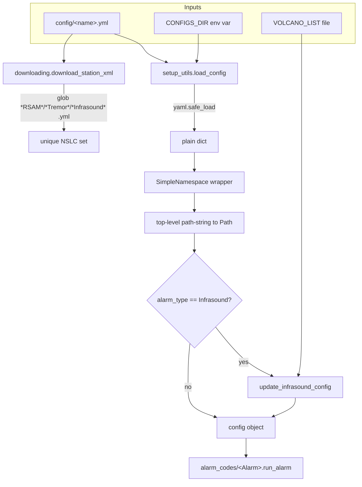
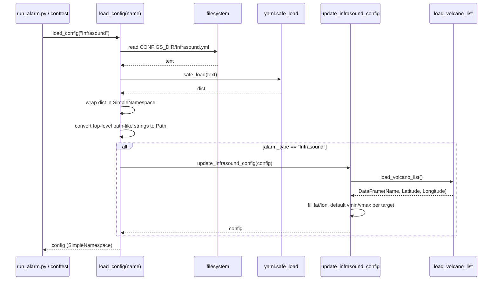

# Design Document: YAML Config Migration

## Overview

The alarm system loads per-alarm configuration by `exec`-ing a Python module
(`config/{name}.py`) via `setup_utils.load_config` and reading attributes off the
resulting module object. This migration replaces the executable `.py` config
modules with declarative YAML (`config/{name}.yml`), parsed with
`yaml.safe_load`, while preserving the runtime behavior the alarm code depends on
(path-string→`Path` conversion, the Infrasound target enrichment, and the
NSLC/threshold values that drive detection).

The `.yml` files already checked into `config/` are **not** a 1:1 translation of
the `.py` modules — the schema was intentionally restructured (lowercase/snake
keys, RSAM stations split into `rsam_stations`/`infrasound`/`arrestor`,
Infrasound `nslc` as plain strings, `targets` instead of `TARGETS`, Tremor
`grid` as start/end/step scalars instead of NumPy arrays, and UPPERCASE
attributes like `MAGMIN`/`DURATION`/`VOLCANO_DISTANCE` lowered to `magmin`/
`duration`/`volcano_distance`). This spec adopts that restructured YAML as the
**canonical schema** and **refactors the alarm code to read it directly** (the
decision recorded below), rather than hiding a compatibility adapter inside the
loader.

This is a **hard switch**: after migration, `load_config` reads only `.yml`, the
`.py` config modules are deleted, the second consumer (`download_station_xml`) is
migrated, the test harness (`conftest.py`) is updated, and the frozen golden
behavior baselines are re-captured to reflect the new canonical config values
and any message-ordering changes the restructured schema introduces.

### Decisions (confirmed with the user)

| Decision | Choice |
| --- | --- |
| Feature name | `yaml-config-migration` |
| Canonical schema | The restructured lowercase/snake YAML already in `config/*.yml` |
| Schema reconciliation | **Refactor alarm code to consume the new YAML schema directly** (no loader-side per-alarm adapter) |
| Config object shape | `load_config` returns a `SimpleNamespace` so alarm code keeps **attribute access** (`config.alarm_name`); nested values stay native YAML lists/dicts |
| Cutover | **Hard switch** to YAML; delete `config/*.py`; re-freeze golden baselines once |
| Implementation language | Python (`yaml.safe_load`; `pyyaml` and `python-dotenv` are already dependencies) |

## Goals and Non-Goals

### Goals

- Parse `config/{name}.yml` with `yaml.safe_load` and return an object that
  exposes top-level keys as attributes.
- Preserve the existing top-level path-string→`pathlib.Path` conversion semantics.
- Preserve the Infrasound target enrichment (`update_infrasound_config`): fill
  `lat`/`lon` from the volcano list and default `vmin`/`vmax`.
- Refactor every alarm package (and its `detection`/`figure`/`message`
  submodules) to read the canonical YAML keys.
- Migrate `download_station_xml()` to read `.yml`.
- Update the test harness and re-freeze golden behavior baselines so the
  behavior-preservation suite passes against the new loader/schema.
- Delete the `config/*.py` modules after cutover.

### Non-Goals

- No change to detection algorithms, thresholds, message wording, or figure
  layout **beyond** what the restructured schema unavoidably implies (e.g. RSAM
  per-station ordering in the heartbeat string — see
  [RSAM reconstruction](#rsam-stations-arrestor-and-infrasound)).
- No new config keys or features; values are migrated as-is.
- No change to the `argparse`/dispatch flow other than the config-loading path.

### Relationship to `alarm-modules-restructure` (conflict)

The active `.kiro/specs/alarm-modules-restructure/` spec **explicitly freezes the
opposite of this spec**:

- Requirement 10.1: "THE restructure SHALL keep the existing `.py` config
  modules loaded from `CONFIGS_DIR` unchanged, preserving the `load_config`
  contract that reads and execs `CONFIGS_DIR/{config_name}.py`."
- Requirement 10.3: continue reading metadata through `setup_utils.py`
  (`load_config`, `load_volcano_list`, `update_infrasound_config`) "without
  changing their public call signatures."
- Its Non-Goals list "No change to the runtime `.py` config modules … and the
  `load_config` contract are unchanged" and "No change to the public signatures
  in `utils/setup_utils.py`."
- Its harness note (and `conftest.py`) states the `config/*.yml` files "are not
  consumed."

**This spec deliberately supersedes that decision.** To avoid churning the same
files twice and invalidating the restructure's golden baselines mid-flight, this
migration **should land after / be coordinated with** `alarm-modules-restructure`.
`load_config`'s public signature (`load_config(config_name)`) is intentionally
**preserved** so the dispatcher contract from that spec still holds; only the
loader's internals and the on-disk config format change.

## Architecture





## Canonical YAML Schema

### Shared base (every alarm)

```yaml
alarm_type: <str>     # selects the alarm module: avo_alarms.alarm_codes.<alarm_type>
alarm_name: <str>     # name used in Icinga + alert messages
```

Top-level scalar string values that "look like a path" (contain `/` or `\`,
start with `.`/`~`/`$`, or match `name.ext`) are converted to `pathlib.Path`.
**Only top-level scalar strings are converted** — list/dict members (e.g. NSLC
strings like `AV.SDPI.01.HDF`) are left untouched, matching the current loader
which only walked module-level string attributes.

### Per-alarm sections and the `.py` → `.yml` → code mapping

The table below records, for each alarm, the current `.py` attribute, the
canonical `.yml` key, and the resulting attribute the refactored alarm code
reads. "code read change" marks reads that must be updated in this spec.

#### RSAM (`config/RSAM.yml`)

| `.py` attribute | canonical `.yml` key | refactored code read | change? |
| --- | --- | --- | --- |
| `NSLC` (combined list of `{nslc,value}`, arrestor last, infrasound inline w/ sentinel `value`) | `rsam_stations` (list of `{nslc,value}`) + `infrasound` (list of str) + `arrestor` (`{nslc,value}`) | `config.rsam_stations`, `config.infrasound`, `config.arrestor` | **yes** |
| `VOLCANO_NAME` | `volcano_name` | `config.volcano_name` | **yes** |
| `duration`,`latency`,`min_sta`,`taper_val`,`f1`,`f2` | same | same | no |

#### Infrasound (`config/Infrasound.yml`)

| `.py` attribute | canonical `.yml` key | refactored code read | change? |
| --- | --- | --- | --- |
| `NSLC` (list of `{nslc}`) | `nslc` (list of str) | `config.nslc` (list of str) | **yes** |
| `TARGETS` (list of dict) | `targets` (list of dict) | `config.targets` | **yes** |
| `duration`,`latency`,`taper_val`,`f1`,`f2`,`min_cc`,`min_chan`,`cc_shift_length` | same | same | no |

#### Tremor (`config/Tremor.yml`)

| `.py` attribute | canonical `.yml` key | refactored code read | change? |
| --- | --- | --- | --- |
| `NSLC` (list of `{nslc,lat,lon}`, only `nslc` used) | `nslc` (list of str) | `config.nslc` (list of str) | **yes** |
| `grid` (dict of NumPy `arange` arrays) | `grid` (dict of `*_min`/`*_max`/`*_step` scalars) | code builds `arange` from scalars | **yes** |
| `volcano`,`rsam_station`,`rsam_threshold`,`duration`,`threshold`,`window_length`,`latency`,`taper`,`f1`,`f2`,`highpass`,`lowpass`,`min_sta`,`Cmin`,`Cmax`,`bstrap`,`bstrap_prct`,`max_scatter`,`phase_list`,`grid_file` | same | same | no |

#### Magnitude (`config/Magnitude.yml`)

| `.py` attribute | canonical `.yml` key | refactored code read | change? |
| --- | --- | --- | --- |
| `MAGMIN` | `magmin` | `config.magmin` | **yes** |
| `MAXDEP` | `maxdep` | `config.maxdep` | **yes** |
| `DISTANCE` | `distance` | `config.distance` | **yes** |
| `DURATION` | `duration` | `config.duration` | **yes** |
| `mattermost_channel_id`,`mm_response_channels` | same | same | no |

#### Swarm (`config/Swarm.yml`)

| `.py` attribute | canonical `.yml` key | refactored code read | change? |
| --- | --- | --- | --- |
| `MAGMIN` | `magmin` | `config.magmin` | **yes** |
| `MAXDEP` | `maxdep` | `config.maxdep` | **yes** |
| `VOLCANO_DISTANCE` | `volcano_distance` | `config.volcano_distance` | **yes** |
| `swarm_parameters` keys `Name`/`Number`,`MAX_EVT_DISTANCE`,`MAX_EVT_TIME`,`MIN_NUM_EVT` | `swarm_parameters` keys `name`,`max_evt_distance`,`max_evt_time`,`min_num_evt` | nested key reads (`swm["max_evt_time"]` etc.) | **yes** |
| `mattermost_channel_id`,`mm_response_channels` | same | same | no |

> Note: the `.py` `swarm_parameters` second entry has a latent typo (`Number`
> instead of `Name`); the canonical `.yml` fixes this to `name`. The refactored
> clustering code reads `name` consistently.

#### Lightning / NOAA_CIMSS / PIREP / SO2 / VAA

These already use lowercase/snake keys in both forms; their consumers read
lowercase attributes (`config.dist1`, `config.dist2`, `config.duration`,
`config.max_distance`, `config.mattermost_channel_id`, `config.ignore_volcanoes`,
`getattr(config, "max_distance", 25)`, etc.). **No code-read changes expected**;
each is verified against its `.yml` during implementation.

## Components and Interfaces

### Component 1: `setup_utils.load_config`

**Purpose**: Load and normalize a single alarm's YAML config.

**Interface** (signature unchanged):

```python
def load_config(config_name: str) -> SimpleNamespace:
    """Load CONFIGS_DIR/{config_name}.yml, return a SimpleNamespace whose
    top-level keys are attributes; convert top-level path-like strings to Path;
    run update_infrasound_config when alarm_type == 'Infrasound'."""
```

**Responsibilities**:
- Build `CONFIGS_DIR/{config_name}.yml` and `yaml.safe_load` it.
- Wrap the resulting dict in `SimpleNamespace` (top-level attribute access).
- Convert top-level scalar path-like strings to `Path` (reuse existing
  `looks_like_path` predicate).
- Dispatch to `update_infrasound_config` for Infrasound.

### Component 2: `setup_utils.update_infrasound_config`

**Purpose**: Enrich Infrasound targets with location + velocity defaults.

**Interface** (signature unchanged; internal attribute name updated):

```python
def update_infrasound_config(config: SimpleNamespace) -> SimpleNamespace:
    """For each entry in config.targets, fill lat/lon from the volcano list
    when absent and default vmin/vmax (env INFRASOUND_VMIN/VMAX)."""
```

**Responsibilities**:
- Iterate `config.targets` (was `config.TARGETS`), mutate each dict in place.

### Component 3: `downloading.download_station_xml`

**Purpose**: Collect the union of NSLC across seismic alarms to refresh station
metadata.

**Interface** (signature unchanged):

```python
def download_station_xml() -> None:
    """Glob CONFIGS_DIR for *RSAM*.yml / *Tremor*.yml / *Infrasound*.yml,
    yaml.safe_load each, collect NSLC, and write STATION_XML."""
```

**Responsibilities**:
- Glob `*.yml` (not `*.py`) for the three seismic alarm types.
- Extract NSLC per the **canonical** schema:
  - RSAM: `rsam_stations[*].nslc` + `infrasound[*]` + `arrestor.nslc`.
  - Tremor: `nslc[*]` (plain strings).
  - Infrasound: `nslc[*]` (plain strings).
- De-duplicate and download as today.

### Component 4: Alarm packages (`alarm_codes/<Alarm>`)

**Purpose**: Read config via the canonical attribute names.

**Responsibilities** (the read-site refactors): see the per-alarm mapping tables
above and the [refactor map](#alarm-code-refactor-map).

## Data Models

### `SimpleNamespace` config object

- Top-level YAML mapping keys become attributes.
- Nested values remain native Python (`list`, `dict`, scalars), matching how
  the current code indexes nested data (`config.targets[i]["min_pa"]`,
  `swm["max_evt_time"]`).
- `hasattr`/`getattr` work as before (e.g. RSAM `hasattr(config, "volcano_name")`,
  NOAA_CIMSS `getattr(config, "max_distance", 25)`).

**Validation rules**:
- `alarm_type` and `alarm_name` must be present (required by the dispatcher and
  messaging).
- `alarm_type` must resolve to an importable `avo_alarms.alarm_codes.<alarm_type>`.
- Seismic alarms must yield at least one NSLC entry.

## Algorithmic Pseudocode

### `load_config`

```python
def load_config(config_name):
    config_path = Path(os.environ["CONFIGS_DIR"]) / f"{config_name}.yml"
    with open(config_path, "r") as f:
        data = yaml.safe_load(f)           # dict

    config = SimpleNamespace(**data)       # top-level attribute access

    # ASSERT: every YAML top-level key is now an attribute of config
    for key, value in vars(config).items():
        if isinstance(value, str) and looks_like_path(value):
            setattr(config, key, Path(value))

    if config.alarm_type == "Infrasound":
        config = update_infrasound_config(config)

    return config
```

**Preconditions:**
- `CONFIGS_DIR` is set and `CONFIGS_DIR/{config_name}.yml` exists and is valid YAML.
- The YAML root is a mapping (not a sequence/scalar).

**Postconditions:**
- Returns a `SimpleNamespace`; each top-level YAML key is an attribute.
- Every top-level scalar string that satisfies `looks_like_path` is a `Path`.
- All other values are byte-for-byte the parsed YAML values.
- If `alarm_type == "Infrasound"`, each target has `lat`,`lon`,`vmin`,`vmax`.

**Loop invariant (conversion loop):** after processing each key, every key
already visited holds either its original non-string/non-path value or a `Path`;
no key is added or removed.

### `update_infrasound_config` (attribute rename only)

```python
def update_infrasound_config(config):
    df = load_volcano_list()
    VMIN = os.environ.get("INFRASOUND_VMIN", 0.28)
    VMAX = os.environ.get("INFRASOUND_VMAX", 0.45)
    for i, target in enumerate(config.targets):       # was config.TARGETS
        if "lat" not in target or "lon" not in target:
            row = df[df["Name"] == target["name"]].squeeze()
            config.targets[i].update({"name": row["Name"],
                                      "lon": row.Longitude.item(),
                                      "lat": row.Latitude.item()})
        if "vmin" not in target:
            config.targets[i].update({"vmin": VMIN})
        if "vmax" not in target:
            config.targets[i].update({"vmax": VMAX})
    return config
```

### RSAM stations, arrestor, and infrasound

The current RSAM `run_alarm` builds one ordered `DataFrame.from_dict(config.NSLC)`
where the **last** row is the arrestor and infrasound `BDF` rows carry a sentinel
`value` (`1e7`) so they can never exceed threshold (plot-only). Detection logic:
`rms[-1] < lvlv[-1]` (arrestor quiet) and `sum(rms[:-1] > lvlv[:-1]) >= min_sta`.

The refactored code reconstructs an equivalent ordered list from the split
schema, **arrestor last**, infrasound channels included as plot-only with a
sentinel value:

```python
SENTINEL = 1e7  # plot-only channels never exceed threshold
stations = (
    list(config.rsam_stations)
    + [{"nslc": ch, "value": SENTINEL} for ch in config.infrasound]
    + [config.arrestor]
)
NSLC = DataFrame.from_dict(stations)
lvlv = np.array(NSLC["value"]); nslc = NSLC["nslc"].tolist()
# ... detection unchanged; reads config.volcano_name instead of config.VOLCANO_NAME
```

**Behavior note (must be re-frozen):** the original `RSAM.py` interleaved an
`AV.CESW..BHZ` seismic channel *after* the two `BDF` infrasound channels. The
canonical split groups all `rsam_stations` first, then `infrasound`. The
**detection outcome is unchanged** (counts of channels exceeding threshold are
order-independent, the arrestor stays last, infrasound keeps its non-triggering
sentinel), but the per-station **ordering in the Icinga heartbeat string**
changes. Because this is a hard cutover, the golden baseline for RSAM is
re-captured to reflect the new ordering. This is the only intentional
message-text change in the migration and is called out explicitly.

### Tremor `grid` reconstruction

```python
from numpy import arange
g = config.grid  # dict of scalars
grid = {
    "lons": arange(g["lon_min"], g["lon_max"] + 1e-3, g["lon_step"]),
    "lats": arange(g["lat_min"], g["lat_max"] + 1e-3, g["lat_step"]),
    "deps": arange(g["depth_min"], g["depth_max"] + 1e-3, g["depth_step"]),
}
```

This reproduces the exact arrays the `.py` `grid` defined.

## Key Functions with Formal Specifications

### `looks_like_path(value) -> bool` (unchanged)

**Preconditions:** `value` is any object.
**Postconditions:** returns `True` iff `value` is a `str` containing a path
separator, starting with `.`/`~`/`$`, or matching `name.ext`; no side effects.

### `download_station_xml() -> None`

**Preconditions:** `CONFIGS_DIR` and `STATION_XML` set; matching `*.yml` exist.
**Postconditions:** `STATION_XML` is written atomically (temp file + replace)
from the de-duplicated union of NSLC across RSAM/Tremor/Infrasound `.yml`.

## Example Usage

```python
# run_alarm.py / conftest
from avo_alarms.utils import setup_utils

config = setup_utils.load_config("RSAM")
assert config.alarm_type == "RSAM"
assert isinstance(config.grid_file, str) is False or True  # RSAM has no grid_file
stations = (list(config.rsam_stations)
            + [{"nslc": c, "value": 1e7} for c in config.infrasound]
            + [config.arrestor])

inf = setup_utils.load_config("Infrasound")
assert all("lat" in t and "lon" in t for t in inf.targets)   # enriched
assert all(isinstance(c, str) for c in inf.nslc)             # plain strings

trem = setup_utils.load_config("Tremor")
assert isinstance(trem.grid_file, Path)                      # path-converted
```

## Alarm Code Refactor Map

| Alarm | Files to touch | Reads to change |
| --- | --- | --- |
| RSAM | `RSAM/__init__.py`, `figure.py`, `message.py` | build `stations` from `rsam_stations`+`infrasound`+`arrestor`; `VOLCANO_NAME`→`volcano_name` |
| Infrasound | `Infrasound/__init__.py`, `detection.py`, `figure.py`, `message.py`; `setup_utils.update_infrasound_config` | `NSLC`(list of dict)→`nslc`(list of str); `TARGETS`→`targets` |
| Tremor | `Tremor/__init__.py`, `detection.py`, `figure.py` | `NSLC`(list of dict)→`nslc`(list of str); `grid` arrays→build from scalars |
| Magnitude | `Magnitude/__init__.py`, `detection.py` | `MAGMIN`/`MAXDEP`/`DISTANCE`/`DURATION`→lowercase |
| Swarm | `Swarm/__init__.py`, `detection.py` | `MAGMIN`/`MAXDEP`/`VOLCANO_DISTANCE`→lowercase; `swarm_parameters` nested keys→snake_case |
| Lightning | verify only | none expected |
| NOAA_CIMSS | verify only | none expected |
| Pilot_Report (PIREP) | verify only | none expected |
| SO2 | verify only | none expected |
| VAA | verify only | none expected |
| `download_station_xml` | `utils/downloading.py` | glob `.yml`; extract NSLC per canonical schema |

## Error Handling

### Missing config file

**Condition**: `CONFIGS_DIR/{name}.yml` does not exist.
**Response**: `FileNotFoundError` propagates from `open` with the resolved path.
**Recovery**: caller (dispatcher) logs and aborts that alarm run.

### Malformed YAML

**Condition**: file is not valid YAML or the root is not a mapping.
**Response**: `yaml.YAMLError` (or a clear `TypeError`/`ValueError` when the root
is not a mapping) propagates.
**Recovery**: surfaced to the operator; no partial config object is returned.

### Missing required key

**Condition**: `alarm_type`/`alarm_name` absent, or an alarm reads a key the YAML
lacks.
**Response**: `AttributeError` on attribute access (same failure mode as a
missing module attribute today).
**Recovery**: caught by the dispatcher's per-alarm error path.

### Unknown volcano in Infrasound target

**Condition**: a target `name` is not in the volcano list and lacks explicit
`lat`/`lon`.
**Response**: the `.squeeze()` lookup yields empty → error during enrichment
(same as today).
**Recovery**: operator adds the volcano or inlines `lat`/`lon` in the `.yml`.

## Testing Strategy

### Unit testing approach

- `load_config` on each migrated alarm: top-level keys present as attributes;
  top-level path-like strings are `Path`; nested NSLC strings remain `str`.
- `update_infrasound_config`: targets enriched with `lat`/`lon`/`vmin`/`vmax`;
  env overrides for `INFRASOUND_VMIN`/`VMAX` respected.
- RSAM station reconstruction yields arrestor-last ordering and plot-only
  infrasound channels with the sentinel value.
- `download_station_xml` NSLC extraction returns the expected union from `.yml`.

### Property-based testing approach

Applicable where behavior varies meaningfully with input and the unit is pure:

- **Path conversion**: for any mapping of top-level keys, only scalar strings
  satisfying `looks_like_path` become `Path`; everything else is unchanged
  (idempotent, no key add/remove).
- **NSLC extraction invariant**: for any RSAM-shaped config, the extracted NSLC
  set equals `{rsam_stations.nslc} ∪ {infrasound} ∪ {arrestor.nslc}`.
- **Infrasound enrichment**: for any target list, after enrichment every target
  has `lat`,`lon`,`vmin`,`vmax`, and pre-existing values are preserved.

**Property test library**: Hypothesis.

### Behavior-preservation (golden baselines)

- `tests/alarms/conftest.py`: keep loading **real** configs via
  `setup_utils.load_config`, but update the module docstring (drop the
  "`.yml` … not consumed" note) — the loader now reads `.yml` exclusively. No env
  changes are required (`CONFIGS_DIR` still points at `config/`).
- **Re-freeze** `tests/alarms/baselines/*.json` after the loader + schema refactor.
  The RSAM heartbeat per-station ordering change is expected and intentional; all
  other alarms' baselines should be unchanged in content (only the loader path
  differs). Re-capture is a single, reviewed step.
- The behavior-preservation suite then asserts each alarm's `run_alarm` output
  matches the re-frozen baselines under the shared test doubles.

### Integration testing approach

- `download_station_xml` with a temp `CONFIGS_DIR` containing representative
  `.yml` files (mocked IRIS client) to confirm the `.yml` glob + NSLC union.

## Dependencies

- `pyyaml` (`yaml.safe_load`) — already a project dependency.
- `python-dotenv` — already used by `setup_utils.load_environment`.
- `pandas`, `obspy`, `numpy` — unchanged.

## Correctness Properties

These are universally-quantified properties that must hold for **all** valid
inputs, suitable for property-based testing with Hypothesis. Each maps to the
requirement clause(s) it validates. Example-based and edge-case checks live in
the unit/integration tests described in the Testing Strategy.

### Property 1: Top-level path-conversion invariant

**Statement:** For any mapping of top-level keys to values, after `load_config`
processes it: (a) every top-level scalar string satisfying `looks_like_path`
becomes a `pathlib.Path`; (b) every other top-level value (non-string scalars,
strings failing the predicate, lists, dicts) is unchanged and equal to the
parsed YAML value; (c) strings nested inside list/dict values are never
converted; (d) the set of top-level keys is preserved exactly (none added or
removed); and (e) re-running the conversion is idempotent.

**Validates:** Requirements 2.1, 2.2, 2.3, 2.4, 1.3

### Property 2: RSAM NSLC-extraction set invariant

**Statement:** For any RSAM-shaped config, the set of NSLC extracted (by both the
RSAM station reconstruction and the Station_Metadata_Downloader) equals
`{s.nslc for s in rsam_stations} ∪ {ch for ch in infrasound} ∪ {arrestor.nslc}`.
Additionally, in the reconstructed ordered station list the arrestor is the final
entry and every infrasound channel carries the Sentinel_Value (`1e7`).

**Validates:** Requirements 4.1, 4.2, 4.3, 10.2

### Property 3: Infrasound enrichment completeness

**Statement:** For any list of targets, after `update_infrasound_config` every
target has `lat`, `lon`, `vmin`, and `vmax` defined; any `lat`/`lon`/`vmin`/`vmax`
present before enrichment is preserved byte-for-byte; and missing `vmin`/`vmax`
default to the `INFRASOUND_VMIN`/`INFRASOUND_VMAX` env values (`0.28`/`0.45`).

**Validates:** Requirements 3.2, 3.3, 3.4, 3.5, 3.6

### Property 4: Tremor grid `arange` array equality

**Statement:** For any `grid` scalar bounds/steps, the reconstructed longitude,
latitude, and depth arrays equal `arange(min, max + 0.001, step)` for the
respective dimension — reproducing the exact arrays the Python `grid` definition
produced.

**Validates:** Requirements 6.2, 6.3
