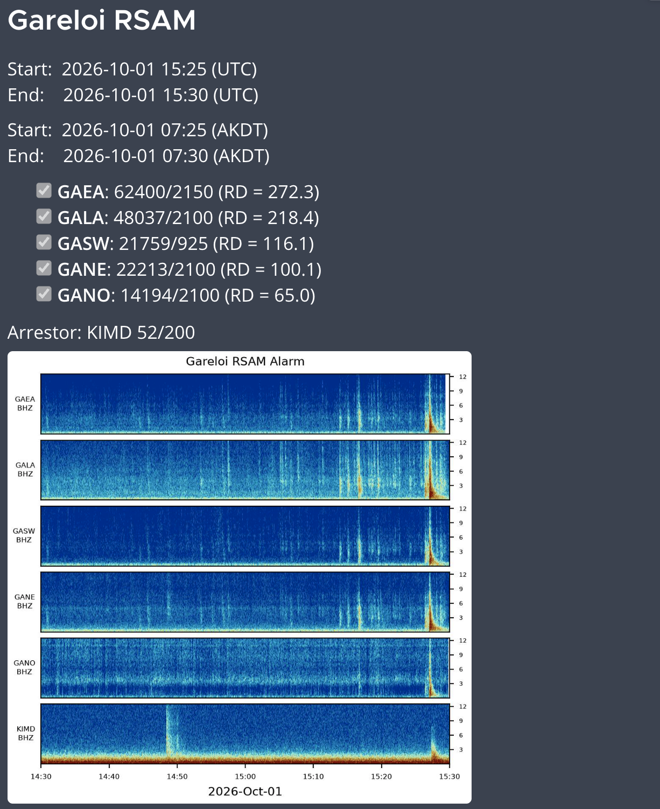
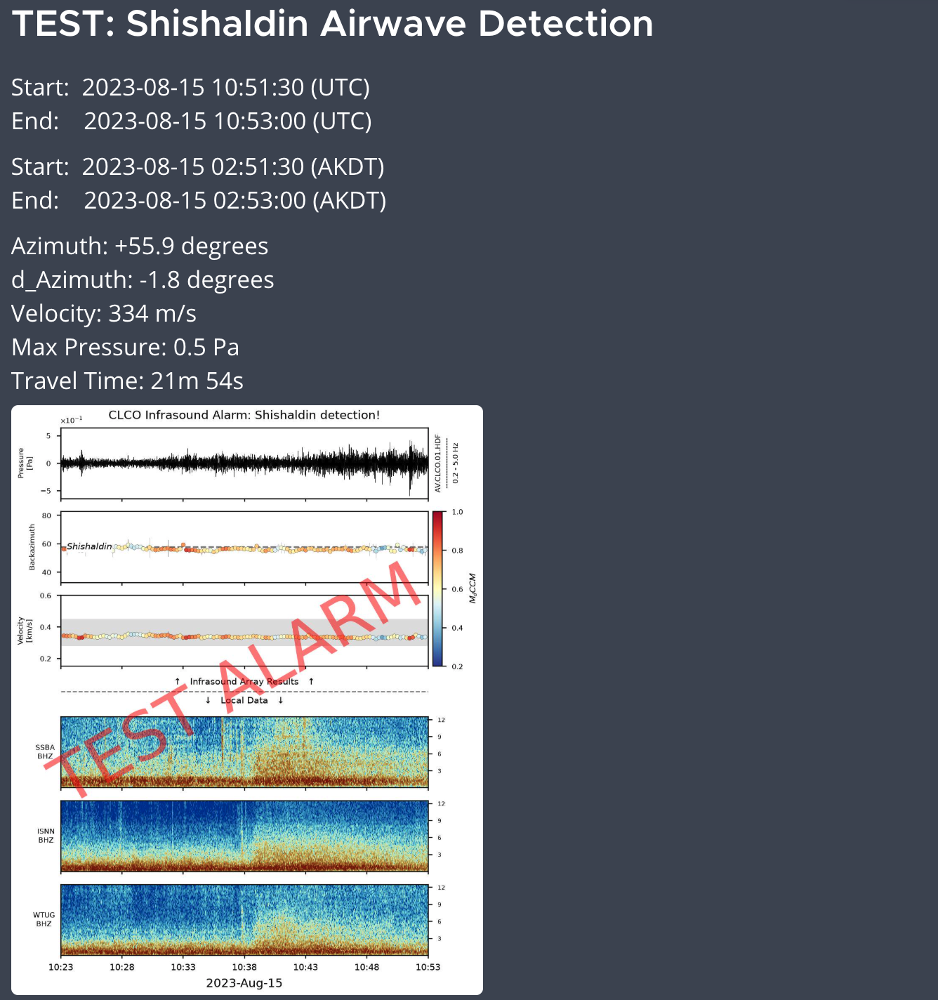
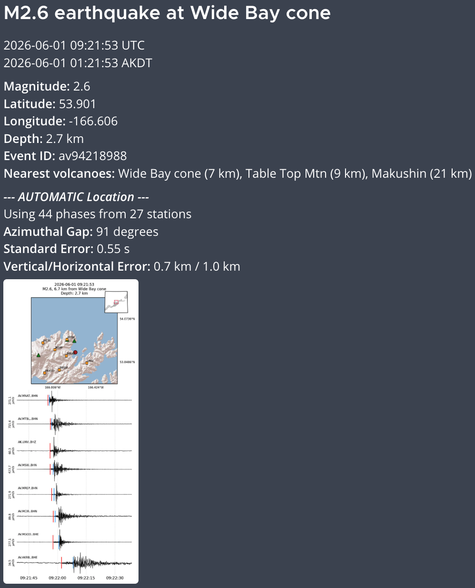
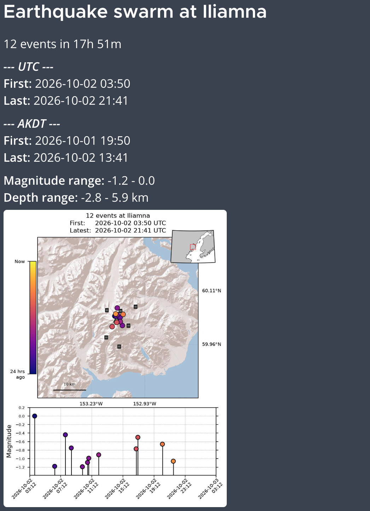
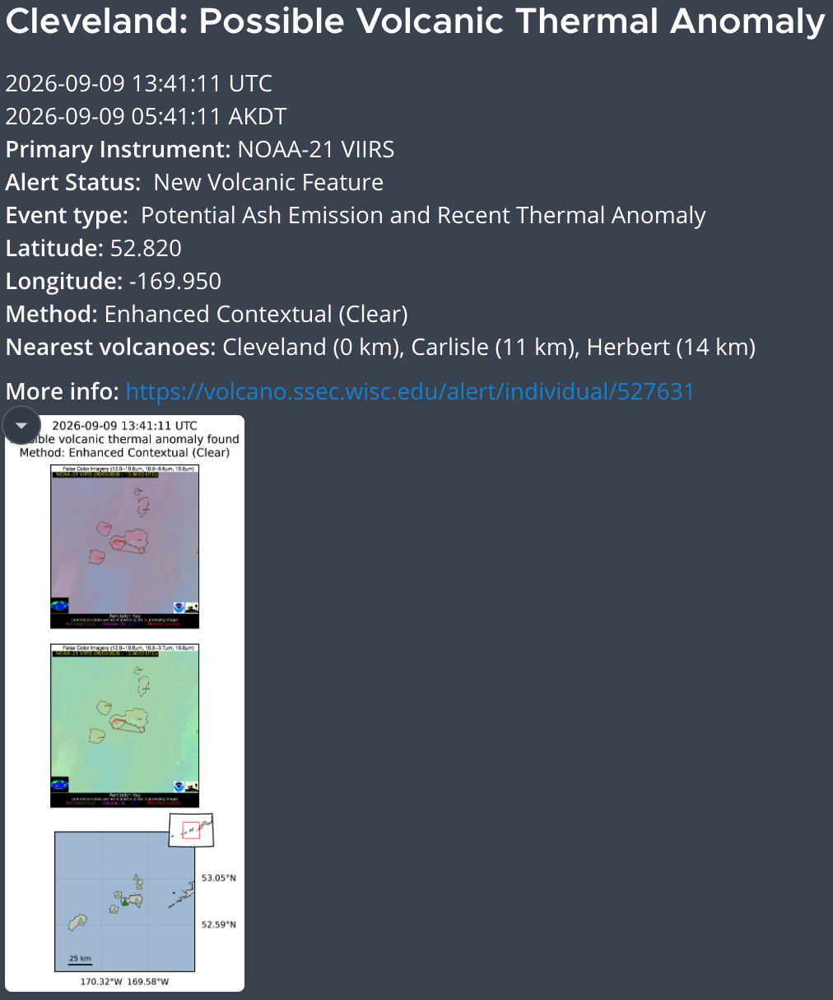
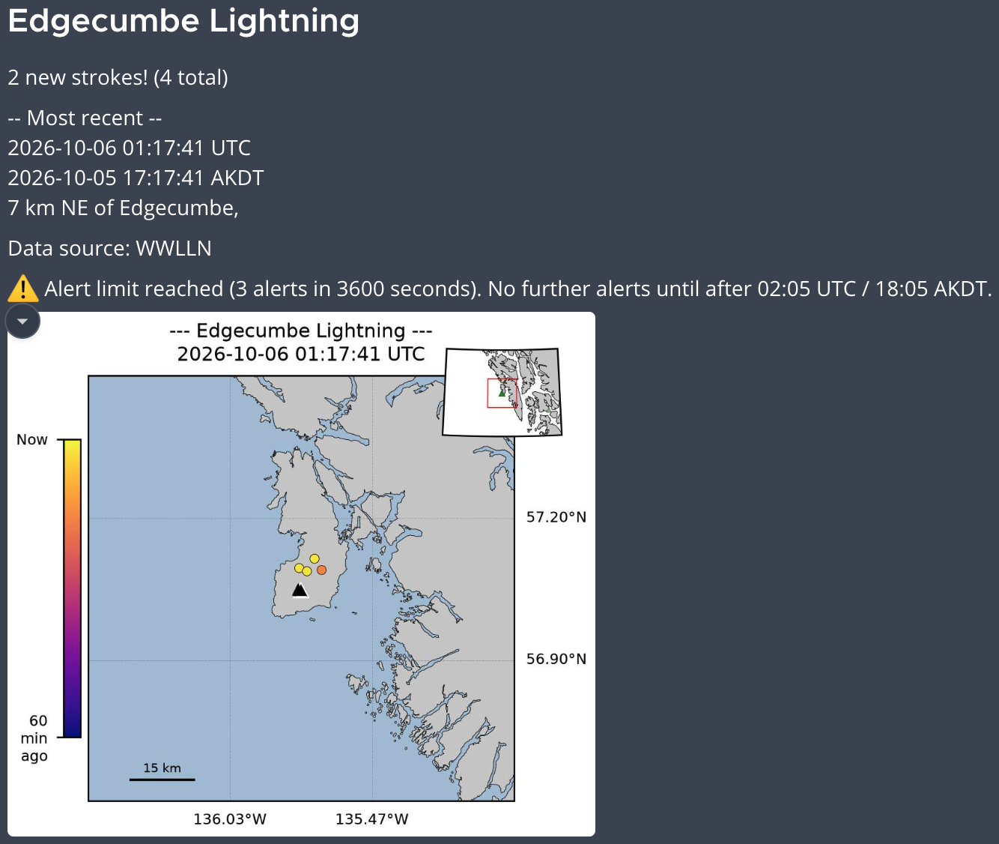
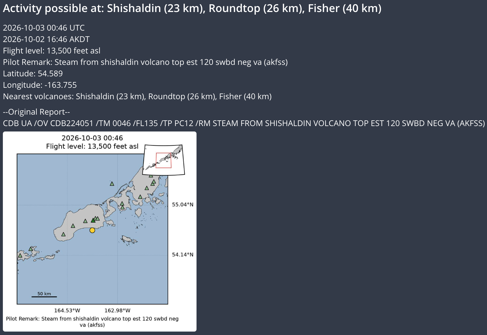
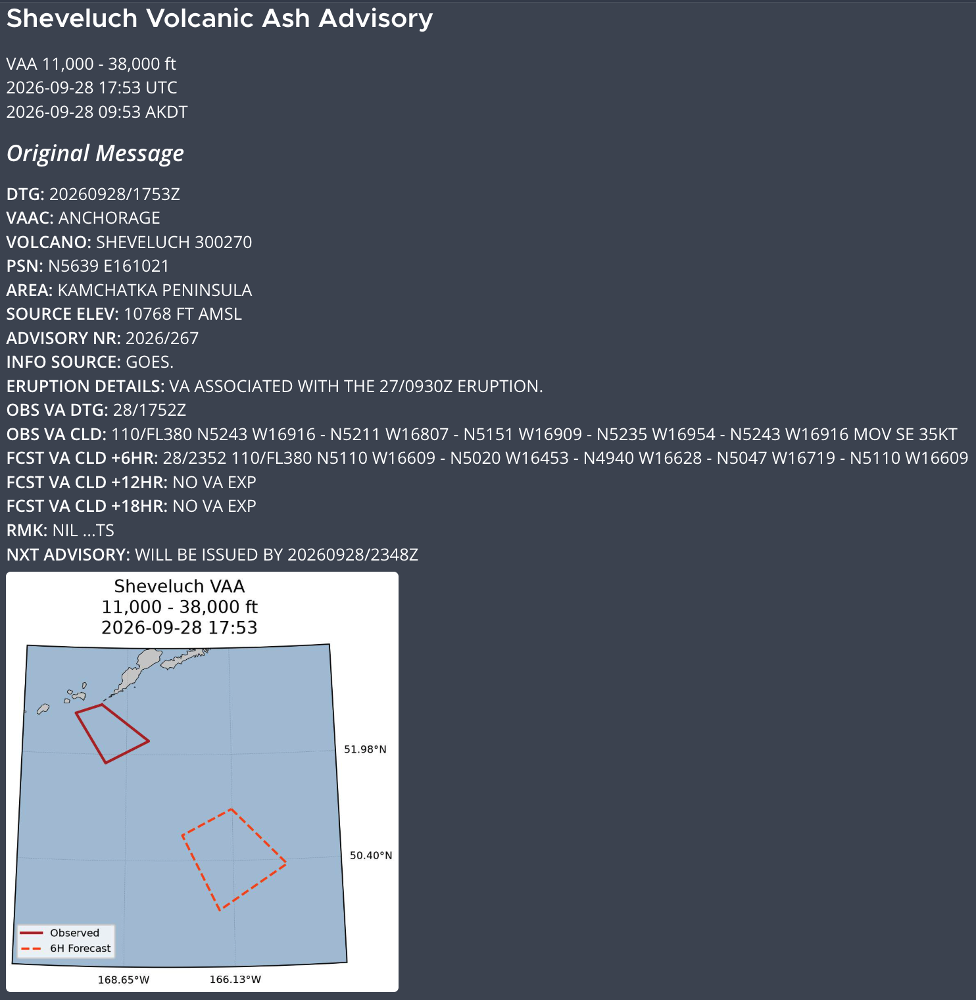

# Alarm Modules

Each alarm type lives in its own package under `src/volc_alarms/alarms/` and exposes a `run_alarm` entry point invoked by `run-alarm` for configs whose `alarm_type` matches the module name. A module typically splits into three files: `detection.py` (data + logic), `figure.py` (plotting), and `message.py` (alert text).

The alarm types below correspond to the configs in `config/` and the entries in `volc_alarms.__all__`.

## Seismo-acoustic

### RSAM
Downloads and conditions waveform data for a set of stations plus an arrestor station, computes each station's RSAM level (and optional reduced displacement), and compares against per-station thresholds. A detection requires at least `min_sta` stations over threshold while the arrestor stays below its threshold; detections escalate to CRITICAL and send an alert with a spectrogram figure. Lesser conditions map to elevated, arrested, missing-data, or normal states.

??? example "Example alert"
    

### Infrasound
Downloads and conditions infrasound array data, runs least-trimmed-squares (LTS) array processing to estimate back-azimuth and trace velocity, and compares the results against each configured volcano target. When a target's filters are satisfied, it issues an airwave-detection alert with a figure and message.

The LTS processing relies on Jordan Bishop's least trimmed squares package [package](https://uaf-lts-array.readthedocs.io/en/master/index.html#){:target="_blank"} (vendored in `src/volc_alarms/_vendor/lts_array`), which performs the calculations to estimate trace velocity, back-azimuth, cross-correlation maxima, and flagged array element pairs (details: [https://doi.org/10.1093/gji/ggaa110](https://doi.org/10.1093/gji/ggaa110){:target="_blank"})

??? example "Example alert"
    
    
    ⚠️ Note TEST subject and watermark

### Tremor
Downloads waveform data for a set of stations, builds band-passed and high-passed envelopes, and locates tremor/swarm sources via `enveloc` cross-correlation. New locations are merged with recent events from the database and the total seismicity duration over the lookback window is computed. Duration (and an optional RSAM amplitude gate) classify the result: a sustained detection with new events escalates to CRITICAL, while lesser conditions map to elevated, low-amplitude, missing-data, or normal states.

## Earthquake catalog

### Magnitude
Queries an FDSN event service for recent earthquakes above a magnitude threshold and below a depth cap, keeps those near a volcano, and for each new (not already processed) event sends a CRITICAL alert with a summary figure and message. No-event, far-from-volcano, and already-processed cases report an Icinga heartbeat; FDSN connection errors report a warning.

??? example "Example alert"
    

### Swarm
Downloads recent hypocenters, associates them with the nearest volcano, and clusters them in space and time (DBSCAN) to identify swarms. Distinguishes brand-new swarms from continuations of ongoing swarms, de-duplicates overlapping clusters, and issues a CRITICAL alert with a map and magnitude-vs-time figure for each new swarm. Processed events are recorded to the swarm catalog table. Distinct swarm definitions can be set.

??? example "Example alert"
    

## Satellite & lightning

### NOAA_CIMSS
Pulls recent NOAA/CIMSS alerts (ash, thermal, ice) from the Volcview API, associates each with the nearest volcano, and suppresses alert types opted out per volcano. For each new, unprocessed alert, it scrapes the CIMSS alert page for details and imagery, then issues a CRITICAL alert with a figure and message (routing thermal and elevated-volcano alerts to extra channels).

??? example "Example alert"
    

### SO2
Scrapes the SACS SO2 notification page, associates each detection with the nearest volcano (within `max_distance`), downloads the associated SO2 imagery, and issues an alert for new detections. Posts to a dedicated Mattermost channel.
!!! Note "Untested"
    The SO2 alarm module has not been tested since the latest code refactorization. The webpage it scrapes is not super reliable, and true positives are too rare (and ephemeral) to reliably test. It is not included in the pytests and should not be considered operational. It is only included here for full disclosure and as a placeholder for (hopefully) future development.

### Lightning
Pulls recent lightning strokes from the Volcview API, associates each with the nearest volcano, and separates new strokes from those already processed. Strokes are grouped by volcano and classified as proximal (inside the inner ring) or distal; a proximal first-detection escalates to CRITICAL and issues an alert with a map figure and message.

??? example "Example alert"
    

    ⚠️ Note the alert limit was reached for the example

## Advisory feeds

### Pilot_Report
Downloads recent pilot reports (PIREPs) from the IEM API, keeps those near a volcano, and flags reports whose text mentions volcanic activity. Each new, unprocessed flagged report sends an alert (CRITICAL when the report is marked urgent, otherwise WARNING) with a location figure and message. No-report and already-processed cases report an Icinga heartbeat.

??? example "Example alert"
    

### VAA
Downloads the recent Volcanic Ash Advisory list from the Mesonet API, parses each text advisory, associates it with the nearest volcano, and issues a CRITICAL alert for any new advisory within the lookback window. Each alert includes a map of the observed/forecast ash cloud polygons and a message reproducing the advisory.

??? example "Example alert"
    

---

See the [API Reference](api-reference.md) for the auto-generated `run_alarm` signatures and the shared utilities each module uses.
